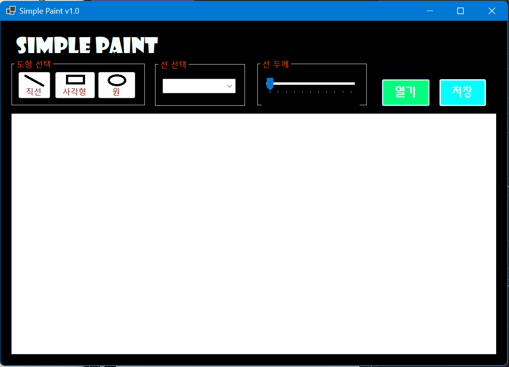

# (C# 코딩) File Compare

## 개요
- C# 프로그래밍 학습
- 1줄 소개: 
- 사용한 플랫폼
	- C#, .NET Windows, Visual Studio, Github
- 사용한 컨트롤
	- Label, Button, GroupBox, Combobox, TrackBar, PictureBox
- 사용한 기술과 구현한 기능
	- 

## 실행 화면 (과제1)
- 코드의 실행 스크린샷과 구현 내용 설명

- 구현한 내용 (위 그림 참조)
	- 전체적인 UI를 구성하며 캔버스를 준비했다.
		- 각 그룹박스에 Button고 ComboBox, TrackBar를 놓았다.
		- '도형 선택' 그룹박스에는 직선, 사각형, 원 이 세 가지 도형 기능을 선택할 수 있는 버튼이 있다. 가독성을 위해 각 도형의 이미지를 버튼에 삽입하고, TextAlign과 ImageAlign을 다루었다.
		- ComboBox에는 색상을 선택할 수 있도록 item속성을 통해 검정, 빨강 등의 선택지를 설정했다.