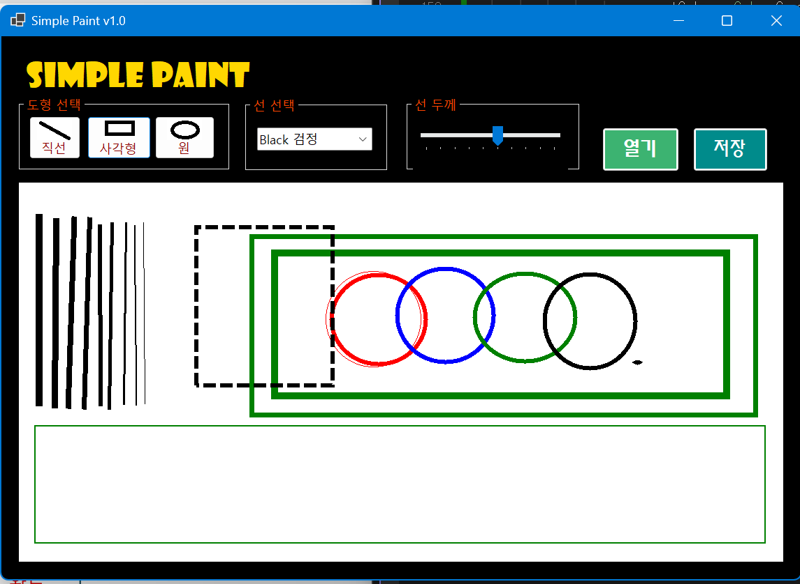

# (C# 코딩) File Compare

## 개요
- C# 프로그래밍 학습
- 1줄 소개: 
- 사용한 플랫폼
	- C#, .NET Windows, Visual Studio, Github
- 사용한 컨트롤
	- Label, Button, GroupBox, Combobox, TrackBar, PictureBox
- 사용한 기술과 구현한 기능
	- 

## 실행 화면 (과제1)
- 코드의 실행 스크린샷과 구현 내용 설명

- 구현한 내용 (위 그림 참조)
	- 전체적인 UI를 구성하며 캔버스를 준비했다.
	- 각 그룹박스에 Button고 ComboBox, TrackBar를 놓았다.
	- '도형 선택' 그룹박스에는 직선, 사각형, 원 이 세 가지 도형 기능을 선택할 수 있는 버튼이 있다. 가독성을 위해 각 도형의 이미지를 버튼에 삽입하고, TextAlign과 ImageAlign을 다루었다.
	- ComboBox에는 색상을 선택할 수 있도록 item속성을 통해 검정, 빨강 등의 선택지를 설정했다.

## 실행 화면 (과제2)
- 코드의 실행 스크린샷과 구현 내용 설명

- 구현한 내용 (위 그림 참조)
	- 마우스 드래그를 이용한 그림 그리기 기능을 구현했다,
	- 도형 선택 그룹박스 내 버튼으로 선택해 pictureBox에 마우스로 드래그하면 도형이 그려진다. (비트맵이라 도형 자체가 나타난다기보다 수많은 픽셀들의 색상이 변하는 것이다)
	- 마우스로 드래그하는 동안(마우스에서 손을 떼기 전)은 점선으로 미리보기 표시가 된다.
	- 함수 중 picCanvas_MouseDown은 마우스 드래그 시작 시 호출되어 시작좌표(startpoint)를 저장하고 isDrawing을 true로 전환한다.
	- picCanvas_MouseMove는 그래그 중 호출되어 현재 좌표(endPoint)를 갱신하고, Invalidate()를 호출한다.
	- picCanvas_Paint는 드래그 중일 때 도형을 점선 형태로 그려 미리보기를 제공한다.
	- cmbColor_SelectedIndexChanged로 색상을 변경하고, trbLineWidth_ValueChanged로 선 두께를 조절할 수 있다.

## 실행 화면 (과제3)
- 코드의 실행 스크린샷과 구현 내용 설명

- 구현한 내용 (위 그림 참조)
	- 

## 실행 화면 (과제4)
- 코드의 실행 스크린샷과 구현 내용 설명

- 구현한 내용 (위 그림 참조)
	- 